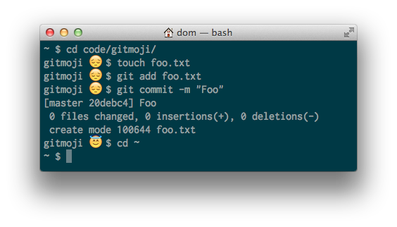

Gitmoji
=======

Displays an emoji based on the amount of time since you last committed
to the git repo in your current directory.

For best results, add it your PS1:

    export PS1="\[\e]0;Terminal\a\]\W \$(gitmoji && echo -n ' ')\$ "

The `gitmoji && echo -n ' '` means it’ll only echo a space if gitmoji
exits cleanly.

That’ll look something like this:

See also
--------

  * [Bashtime](https://github.com/paulsm/bashtime)
  * [Bashmoji](https://github.com/roc/bashmoji)

License
-------

[Unlicensed](http://unlicense.org/). Do anything with it.
